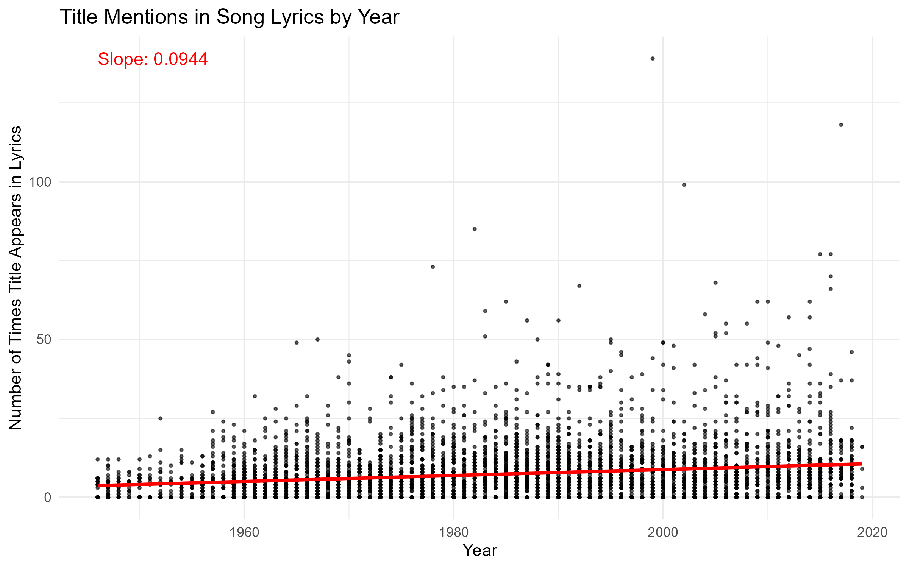

```{r setup, include=FALSE}
knitr::opts_chunk$set(echo = TRUE)
library(tidyverse)
library(tidytext)
library(dplyr)
library(ggplot2)
library(readr)
library(rvest)
library(purrr)
```

```{r, include=FALSE}
songs <- read.csv("combined_all_songs_lyrics(in).csv")
```

## Intro 

In today’s music industry, repetitiveness is often cited as a catchy or commercially successful songs. However, defining what makes a song "repetitive" is far from straightforward. Repetitiveness can refer to repeated words, phrases, melodies, or even structural elements such as choruses. In this project, we aim to explore lyrical repetitiveness across Billboard’s year-end top songs list over time, using a combination of methods and lyrical analysis. Our goal is to identify trends in repetitiveness, investigate whether songs have become more or less repetitive over the decades, and consider how different metrics of repetitiveness might provide further insight.

To do this, we built a dataset of Billboard’s top songs for each year since 1946. For each song, we scraped the lyrics from songlyrics.com and extracted metadata from the Spotify Web API. While some data—such as genre—were incomplete, our dataset still allows for a robust analysis of lyrical repetitiveness over time using multiple approaches.

```{r, include = FALSE, eval=FALSE}
create_songlyrics_url <- function(artist, title) {      # Function to create SongLyrics.com URL given artist and title
  clean <- function(x) {                                # nested function to clean strings
    x %>%
      tolower() %>%                             # Convert to lowercase
      str_replace_all("&", "and") %>%           # replace & with and
      str_replace_all("[^a-z0-9 ]", "") %>%     # remove all non alphabetical/numeric charachters
      str_trim() %>%                            # remove leading/ trailing whitespaces
      str_replace_all(" +", "-")                # replace spaces with dashes for url format
  }
  
  title_main <- str_split(title, "/", simplify = TRUE)[1] %>% str_trim() # Some titles contain ("/"), keep only the first part
  artist_clean <- clean(artist)         # Clean artist strings using the clean() function
  title_clean <- clean(title_main)      # Clean title strings using the clean() function
  # Construct and return full URL
  paste0("https://www.songlyrics.com/", artist_clean, "/", title_clean, "-lyrics/")       # Construct and return the full url 
}

# This Function scrapes lyric text from a SongLyrics.com page
get_lyrics <- function(url) {
  tryCatch({
    page <- read_html(url)               # Read HTML of the page
    lyrics <- page %>%
      html_node(".songLyricsV14") %>%    # Locate lyrics HTML node
      html_text(trim = TRUE)             # Extract and trim text
    return(lyrics)                       # Return the lyrics string
  }, error = function(e) {
    return(NA)                           # Return N.A on failure
  })
}

safe_get_lyrics <- safely(get_lyrics, otherwise = NA)   # Safely wrap the get_lyrics function so errors don't crash the program

# This function Cleans the Title and Artist columns to make sure they are valid UTF-8 strings
clean_titles_artists <- function(df) {
  df %>%
    mutate(
      Title = iconv(as.character(Title), to = "UTF-8", sub = ""),      # Ensures Title is UTF-8
      Artist = iconv(as.character(Artist), to = "UTF-8", sub = "")     # Ensures Artist is UTF-8
    )
}

# This function adds lyrics to the dataframe of songs (Main Function)
get_songs_with_lyrics <- function(df) {
  df %>%
    mutate(
      url = map2_chr(Artist, Title, create_songlyrics_url),    # Creates URL's for each title-artist pair
      lyrics_result = map(url, safe_get_lyrics),               # Safely scrapes lyrics for each URL
      lyrics = map_chr(lyrics_result, ~ .x$result)             # Extract only the lyrics from the result          
    ) %>%
    select(-lyrics_result)                                     # Drops the lyrics_result column (not needed)
}


## Function to clean songs title and artist into usable text
clean_song_data <- function(dataset) {
  library(dplyr)
  library(stringr)
  
  cleaned <- dataset %>%
    rename(Artist = `Artist.s.`) %>%  
    mutate(
      artist_clean = str_to_lower(Artist),
      artist_clean = str_replace_all(artist_clean, "[^a-z0-9]", ""),
      title_clean = str_to_lower(Title),
      title_clean = str_replace_all(title_clean, "[^a-z0-9]", "")
    )
  
  return(cleaned)
}

Sys.setenv(SPOTIFY_CLIENT_ID = 'xxxxxxxxxxxxxxxxxxxxxx')
Sys.setenv(SPOTIFY_CLIENT_SECRET = 'xxxxxxxxxxxxxxxxxxxxxxx')

access_token <- get_spotify_access_token()

allSongsWithDuration <- add_song_duration(songs)

write_csv(allSongsWithDuration, "AllSongsData.csv")

## Function to get duration from spotify web API
get_duration <- function(title, artist) {
  query <- paste(title, artist)
  result <- search_spotify(query, type = "track", limit = 1)
  if (nrow(result) > 0) {
    return(result$duration_ms[1] / 1000)
  } else {
    message(paste("No match found (duration):", query))
    return(NA)
  }
}

add_song_duration <- function(df) {
  df <- df %>%
    rename(Artist = 'Artist(s)') %>%
    rowwise() %>%
    mutate(
      duration_sec = get_duration(Title, Artist),
    ) %>%
    ungroup()
  
  return(df)
}

# These functions filter songs in their respective decades from our Billboard top songs dataset.
# Only filter from 1946 to 2019 because billboard released their top 100 in 1946 and www.songlyrics.com only has lyrics up to 2019

songs_1940 <- songs %>% filter(Year >= 1946 & Year <= 1949) %>% clean_titles_artists()  # Filter songs from the late 1940s (1946–1949) and clean the Title and Artist
songs_1950 <- songs %>% filter(Year >= 1950 & Year <= 1959) %>% clean_titles_artists()  # Filter songs from the 1950s (1950–1959) and clean the Title and Artist 
songs_1960 <- songs %>% filter(Year >= 1960 & Year <= 1969) %>% clean_titles_artists()  # Filter songs from the 1960s (1960–1969) and clean the Title and Artist 
songs_1970 <- songs %>% filter(Year >= 1970 & Year <= 1979) %>% clean_titles_artists()  # Filter songs from the 1970s (1970–1979) and clean the Title and Artist 
songs_1980 <- songs %>% filter(Year >= 1980 & Year <= 1989) %>% clean_titles_artists()  # Filter songs from the 1980s (1980–1989) and clean the Title and Artist 
songs_1990 <- songs %>% filter(Year >= 1990 & Year <= 1999) %>% clean_titles_artists()  # Filter songs from the 1990s (1990–1999) and clean the Title and Artist 
songs_2000 <- songs %>% filter(Year >= 2000 & Year <= 2009) %>% clean_titles_artists()  # Filter songs from the 2000s (2000–2009) and clean the Title and Artist 
songs_2010 <- songs %>% filter(Year >= 2010 & Year <= 2019) %>% clean_titles_artists()  # Filter songs from the 2010s (2010–2019) and clean the Title and Artist 


# These functions scrape lyrics for each using the get_songs_with_lyrics function on the decades datasets and return a dataframe with lyrics, artist, song for each decade

songs_1940_lyrics <- get_songs_with_lyrics(songs_1940) # Scrape song lyrics from the 1940's
songs_1950_lyrics <- get_songs_with_lyrics(songs_1950) # Scrape song lyrics from the 1950's
songs_1960_lyrics <- get_songs_with_lyrics(songs_1960) # Scrape song lyrics from the 1960's
songs_1970_lyrics <- get_songs_with_lyrics(songs_1970) # Scrape song lyrics from the 1970's
songs_1980_lyrics <- get_songs_with_lyrics(songs_1980) # Scrape song lyrics from the 1980's
songs_1990_lyrics <- get_songs_with_lyrics(songs_1990) # Scrape song lyrics from the 1990's
songs_2000_lyrics <-  get_songs_with_lyrics(songs_2000) # Scrape song lyrics from the 2000's
songs_2010_lyrics <- get_songs_with_lyrics(songs_2010) # Scrape song lyrics from the 2010's 

# Combine each decade datafram with lyrics into one dataframe
all_songs_lyrics <- rbind(songs_1940_lyrics, songs_1950_lyrics, songs_1960_lyrics, songs_1970_lyrics, songs_1980_lyrics, songs_1990_lyrics, songs_2000_lyrics, songs_2010_lyrics)

# This function cleans the all_song_lyrics dataset for undesirable values

songs <- all_songs_lyrics[ 
  !is.na(all_songs_lyrics$lyrics) & 
  # Deletes rows with N.A in lyrics column
  !grepl("^We do not have the lyrics for", all_songs_lyrics$lyrics, ignore.case = TRUE) & 
  # Deletes rows that www.songlyrics.com does not have lyrics for
  !grepl("^\\[?Instrumental\\]?$", all_songs_lyrics$lyrics, ignore.case = TRUE), 
  # Deletes rows containing instrumental songs
]


```


## Methods 

To measure lyrical repetitiveness in popular songs, we developed four different analytical techniques. Each method captures a unique dimension of repetition, from word variety to structural reuse, and together they provide a more complete picture of how repetition functions in music over time.

### **Unique-to-Total Word Ratio**
This method helps highlight the variety of words in a song. Values from this method will be in the range [0,1] where a value closer to 0 indicates the song repeated a word many times and a value close to 1 indicates the song used very few repeated words. This method offers a high-level view of lyrical variety and is useful in comparing how word usage and patters may have evolved over time

### **Title Word Repetition**
This method helps highlight a very common trend in songs of repeating the title. The title of a song very often in the focal point or the "message" of a songs so it is often repeated for a greater effect. This approach shows a stylistic trend that is especially popular in pop and radio songs where memorability and recognizably are critical for their commercial success. 

### **Line or Verse Repetition**
As with the method above this also highlights a very common trend in pop or radio songs. Many songs have a hook or chorus that is repeated throughout the songs to again increase the lyrical affect. The chorus is usually separated by verses which help reduce the songs repetitiveness. By measuring how often linear were repeated we can assess how much or a song's structure is built around repitition. Songs with highly repetitive choruses or hooks will score high with this metric

### **Most Repeated Non-Stop Words**
This technique identifies the most frequently used meaningful word in a song’s lyrics. To focus on relevant content, we first remove English stop words like “the,” “and,” or “but” that contribute little to no meaning. This metric reflects how strongly a particular concept, theme, or emotion is emphasized through repetition. For example, a love song might frequently repeat a word like “baby” or “heart,” revealing its emotional focus. By excluding filler words, we better isolate the song’s lyrical intent.


## Analysis 

### Title Word Repitition
```{r, echo = FALSE, message=FALSE, warning=FALSE, fig.align='center'}

# This function counts how many times the title appears in the lyrics for each song
all_songs_lyrics <- songs %>%
  mutate(
    title_lower = tolower(Title), 
    # converts song titles to lowercase (make comparison to lyrics not case-sensitive)
    lyrics_lower = tolower(lyrics),
    # converts song lyrics to lowercase
    title_clean = str_replace_all(title_lower, "[^a-z0-9 ]", ""),
    # removes special characters from title
    title_in_lyrics_count = str_count(lyrics_lower, paste0("\\b", title_clean, "\\b")),
    # count how often cleaned title appears in lyrics
    mentions_per_sec = title_in_lyrics_count / duration_sec
    # Calculate title mentions per second using the duration_sec variable
    )


model <- lm(title_in_lyrics_count ~ Year, data = all_songs_lyrics)
# Fit linear model to get slope (How title mentions change over time)
slope <- round(coef(model)["Year"], 4) 
# extract and round the slope to 4 decimal places

# Plot with slope annotated
p6 <- ggplot(all_songs_lyrics, aes(x = Year, y = title_in_lyrics_count)) +
  geom_point(alpha = 0.6, color = "black", size = .6) + # Plot points for each value
  geom_smooth(method = "lm", color = "red") +           # Add regression line
  annotate(
    "text",
    x = min(all_songs_lyrics$Year, na.rm = TRUE) ,  # Place annotation on left edge of plot   
    y = max(all_songs_lyrics$title_in_lyrics_count, na.rm = TRUE), # Place on the top of plot
    label = paste("Slope:", slope), # Show the slope value
    hjust = 0,
    size = 4, 
    color = "red"
  ) +
  labs(
    title = "Title Mentions in Song Lyrics by Year",      # Plot title
    x = "Year",                                               # X-axis label
    y = "Number of Times Title Appears in Lyrics"             # Y-axis label
  ) +
  theme_minimal()                                             # Use a clean minimal theme

ggsave("repetitive_title_count.png", plot = p6, width = 8, height = 5, dpi = 300, bg = "white")


```

The above plot visualizes the relationship between the number of times a song title appears in its lyrics and the year the song was released. Each point represents an individual song, and a linear regression line was fitted to observe the trend over time. The slope of the line is 0.0944, indicating a slight upward trend on average, newer songs mention their titles slightly more often than older ones. While the slope is small, it still suggests a gradual increase in title repetition over the decades, potentially reflecting changes in songwriting style or audience preferences for more memorable lyrics.

```{r, echo = FALSE, message=FALSE, warning=FALSE, fig.align='center'}
model <- lm(mentions_per_sec ~ Year, data = all_songs_lyrics)
#  Fit a linear model to get slope (How title mentions per second change over time)
slope <- round(coef(model)["Year"], 4)
#  Extract and round the slope to 4 decimal places

#  Plot the mentions per second
p7 <- ggplot(all_songs_lyrics, aes(x = Year, y = mentions_per_sec)) + 
  geom_point(alpha = 0.6,size = .6, color = "black", size = 2) + # Plot points for each value
  geom_smooth(method = "lm", color = "red") +                    # Add regression line
  annotate(
    "text",
    x = min(all_songs_lyrics$Year, na.rm = TRUE),   # Place annotation on left edge of plot
    y = max(all_songs_lyrics$mentions_per_sec, na.rm = TRUE), # Place on the top of plot
    label = paste("Slope:", slope),   # Show the slope value
    hjust = 0,
    size = 4,
    color = "red"
  ) +
  labs(
    title = "Title Mentions (Per Second) in Lyrics by Year",    # Plot title
    x = "Year",                                                 # X-axis Label
    y = "Mentions Per Second"                                   # Y-axis Label
  ) +
  theme_minimal()                                               # Use a clean minimal theme

ggsave("repetitive_title_frequency.png", plot = p7, width = 8, height = 5, dpi = 300, bg = "white")


```

The second plot analyzes title mentions per second, accounting for the length of each song, to determine if repetition has become more concentrated over time. This normalization helps address differences in song duration across eras. The fitted linear model produces a much smaller slope of 0.0003 (3e-04), suggesting an almost flat trend. This implies that although newer songs may say their titles more times overall, the rate at which they do so within the duration of a song hasn't changed significantly. 

### Unique-to-Total 

```{r, echo = FALSE, message=FALSE, warning=FALSE, fig.align='center'}
songs <- read_csv("combined_all_songs_lyrics(in).csv", show_col_types = FALSE) # Reads the csv file and stores it as "songs"

songs_cleaned <- songs %>% # Cleans the lyrics so that there is no unecessary characters
  mutate(
    lyrics = lyrics %>%
      str_replace_all("\\\\n|\\n|\\r", " ") %>%
      str_squish(),
    
    total_words = str_count(lyrics, "\\b\\w+\\b"), # Counts the total amount of words that are in each of the songs
    unique_words = sapply(str_split(tolower(lyrics), "\\W+"), function(words) length(unique(words))), # Finds the amount of unique words in each of the songs
    
    uniqueness = ifelse(total_words > 0, unique_words / total_words, NA) # Calculates the uniqueness score for each of the songs and does that by dividing unique words by total words
  )

p3 <- ggplot(songs_cleaned, aes(x = Year, y = uniqueness)) + # Makes the dot plot that contains all of the data points for year and uniqueness score
  geom_point(color = "black", alpha = 0.5, size = 1.4) + # Settings that I chose for the data points
  geom_smooth(method = "lm", se = FALSE, color = "red") + # Regression line for the data
  labs(
    title = "Lyric Uniqueness Score for Top Three Billboard 100 Songs Per Year", # Title of the graphic
    x = "Year", # Title of the x-axis
    y = "Average Uniqueness Score" # Title of the y-axis
  ) +
  theme_minimal() + # Minimal theme
  theme(plot.title = element_text(hjust = 0.5)) + # Centers the title of the graphic
  coord_cartesian(ylim = c(0,1)) # Makes sure that the graphic only shows y-axis going from 0 to 1 because that is where all of the data lies

ggsave("repetitive_lines_frequency.png", plot = p3, width = 8, height = 5, dpi = 300, bg = "white")


```

For this graphic produced, the factors that were taken into consideration were the top three billboard 100 songs in each year and how unique the lyrics were for those songs in their respective years. To determine how unique the songs were for each of the years, I computed a uniqueness score that consisted of the total amount of unique words in each song divided by the total number of words in each song. As seen in the graph, there is a moderate negative correlation between song lyric uniqueness and increasing years. Over time, it is safe to say that the amount of unique words that are used in songs that reach the top charts of the billboard 100 have decreased.
### Title Word Repetition

### Line or Verse Repetition

```{r, echo = FALSE, message=FALSE, warning=FALSE, fig.align='center'}

#Function to split the lyrics into lines and determine which line is most common. Returns a vector of the most common line, the number of occurences, and the total number of lines in the lyrics.
most_common_line <- function(lyrics) {
  if(is.na(lyrics) || lyrics=="") return(NA_character_) #Ensures there are lyrics for the song in the csv file
  phrases <- unlist(strsplit(lyrics, "\n")) #Splits the lyrics up into individual lines
  if(length(phrases) == 0) return(NA_character_) #Ensures the lyrics are split up by line
  occurrences <- table(phrases) #Counts the number of times each line appears
  if (length(occurrences) == 0) return(NA_character_) #Ensures the table function runs correctly on the lyrics
  sorted <- sort(occurrences, decreasing = TRUE) #Sorts the table of occurences from most to least common
  c(line=names(sorted)[1], line_num=sorted[1], total_lines=length(phrases)) #Returns a vector of the most common line, the number of occurences, and the total number of lines in the lyrics
}

new_songs <- songs %>%
  rowwise() %>%
  mutate(common_line=most_common_line(lyrics)[1], #Creates a column for the most common line in each song
         common_line_count=as.numeric(most_common_line(lyrics)[2]), #Creates a column for the number of times the line appears in the song
         common_line_frequency=(as.numeric(most_common_line(lyrics)[2]))/duration_sec*60) %>% #Creates a column for the number of times a line appears divided by the total duration of the song
  filter(common_line_frequency!=1) #Filters out incomplete lyrics

#Creates a plot of the number of times the most common line appears in a song versus the year the song was released
p1 <- ggplot(new_songs, aes(x=Year, y=common_line_count)) +
  geom_point(alpha=.1) +
  geom_smooth(color="red", se=FALSE) +
  theme_minimal() +
  labs(title="Repetitive Lines Over Time", y="Repetitive Line Count")

ggsave("repetitive_lines_count.png", plot = p1, width = 8, height = 5, dpi = 300, bg = "white")


```


This graph displays the number of times the most common line in a song is repeated over the year it was on the top 100 songs list. Over time, there appears to be a positive correlation between the repetitive lines and the year it was released. Therefore, there is evidence to suggest that lines are becoming repeated more and more as time goes on. However, between 2000 and 2020, there is very little increase in repetitive lines, suggesting that the repetitiveness of songs is stagnating.

```{r, echo = FALSE, message=FALSE, warning=FALSE, fig.align='center'}
#Creates a plot of the frequency of the most common line versus the year the song was released
p2 <- ggplot(new_songs, aes(x=Year, y=common_line_frequency)) +
  geom_point(alpha=.1) +
  geom_smooth(color="red", se=FALSE) +
  theme_minimal() +
  labs(title="Frequency of Repetitive Lines Over Time", y="Repetitive Line Frequency (lines/min)")

ggsave("repetitive_lines_frequency.png", plot = p2, width = 8, height = 5, dpi = 300, bg = "white")


```


This graph displays the frequency of repetitive lines in repetitive lines per minute. This graph takes into account the duration of the song when analyzing repetitiveness. This graph suggests that repetitiveness took a sharp increase between 1945 and 1960, a slight decrease between 1960 and 1980, and a slow increase between 1980 and 2020. Overall, there is a positive correlation between repetitive line frequency and time. This would suggest that songs are becoming slowly more repetitive. This graph provides a slightly better estimate of repetitiveness than the last one because it takes into account the duration of each song. Therefore, longer songs are not considered more repetitive than shorter songs.

### Most Repeated Non-Stop Words

```{r, echo = FALSE, message=FALSE, warning=FALSE, fig.align='center'}
## Get stop words in a suitable format
stop_words <- read_lines("NLTK's list of english stopwords") %>%
  tolower() %>%
  tibble(word = .)

## Remove all songs that have NA as lyrics then split songs lyrics into single
## words that are not stop words for analysis
clean_lyrics <- songs %>%
  filter(!is.na(lyrics)) %>%
  unnest_tokens(word,lyrics) %>%
  anti_join(stop_words, by = "word")

## Get word counts for each word in each songs
word_counts <- clean_lyrics %>%
  count(Title, word, sort = TRUE)

## Get total repeats of all words for each song
summary <- word_counts %>%
  group_by(Title) %>%
  summarize(total_repeats = sum(n[n > 1])) %>%
  arrange(desc(total_repeats))

## Join songs with their number of repeats
songs_with_repeats <- summary %>%
  left_join(songs %>% select(Title, Year), by = "Title")

## Scatter plot with curved regression line of songs repetitiveness over time
p4 <- songs_with_repeats %>%
  ggplot(aes(x = Year, y = total_repeats)) +
  geom_point(alpha = 0.5) +
  geom_smooth(method ="loess", se = FALSE, color = "firebrick") +
  labs(
    title = "Repetitiveness of Lyrics Over Time",
    x = "Year",
    y = "Total Repeated Non-Stop Words" 
  ) +
  theme_minimal()

ggsave("StopWordsPlot.png", plot = p4, width = 8, height = 5, dpi = 300, bg = "white")


```


The above graphics shows our analysis of repetitiveness of lyrics over time in relation to non-stop words. The first plot is just our standard method where we are counting the number of repeated non-stop words. In this plot we can see a consistent upward trend from 1960 to around 2010 when it peaks. This indicates that more modern songs tend to repeat meaningful words more than older songs with a slight tapering in the most recent decade. 


```{r, echo = FALSE, message=FALSE, warning=FALSE, fig.align='center'}


## Join songs with their number of repeats
songs_with_repeats_duration <- summary %>%
  left_join(songs %>% select(Title, Year, duration_sec), by = "Title")

## Scatter plot with curved regression line of songs repetitiveness over time
p5 <- songs_with_repeats_duration %>%
  ggplot(aes(x = Year, y = total_repeats / duration_sec)) +
  geom_point(alpha = 0.5) +
  geom_smooth(method ="loess", se = FALSE, color = "firebrick") +
  labs(
    title = "Repetitiveness of Lyrics Over Time",
    x = "Year",
    y = "Total Repeated Non-Stop Words / duration" 
  ) +
  theme_minimal()

ggsave("StopWordsPlotDuration.png", plot = p5, width = 8, height = 5, dpi = 300, bg = "white")

knitr::include_graphics("StopWordsPlotDuration.png")
```


The second plot takes into consideration the duration of the song where we divide the total number of repeats by the duration. This helps account for longer songs naturally having more words and naturally more repeated words. We can see a U-shaped pattern that indicates a decrease in repetitiveness per unit time from 1960-1980. After this we see a drastic increase in our repetitiveness score. This indicates that modern artists are cramming more repeated words in their songs with respect to duration. 

## Conclusion

Music has been paramount in human culture and society for thousands of years. It can evoke the strongest emotions and elicit the most meaningful memories. Music brings people together in a way that few things do. However, as with everything in life, change is inevitable. Music has changed countless times, sometimes more dramatically than at other times. This project aims to study the change in the repetitiveness of popular music over the past century.

Our analyses indicate there is a definitive increase in repetitiveness over time. Each method of analysis considered both total repetitions and repetitions relative to the song length. All four methods of determining repetitiveness show an increase in repetitiveness over time. Repetitiveness can be classified in many ways, but our analyses show an increase in repeated words, lines, or phrases and an overall decrease in lyrical variety. In essence, modern music repeats the same phrases more commonly and contains fewer unique phrases.

This analysis provides insight into the direction music is heading. With the evolution of digital media, music is as large as ever. While the causes of the increase in repetition were not studied in this analysis, there are plenty of theories to help explain. Are humans simply more attracted to songs with simpler lyrics? Are repetitive songs more popular because the lyrics are easier to remember? Perhaps the digital world has prompted artists to spend less time and effort creating longer, more unique songs because of the ease of widespread media attention. The reasons remain unexplored, yet one thing remains certain: songs are undoubtedly becoming more redundant.
